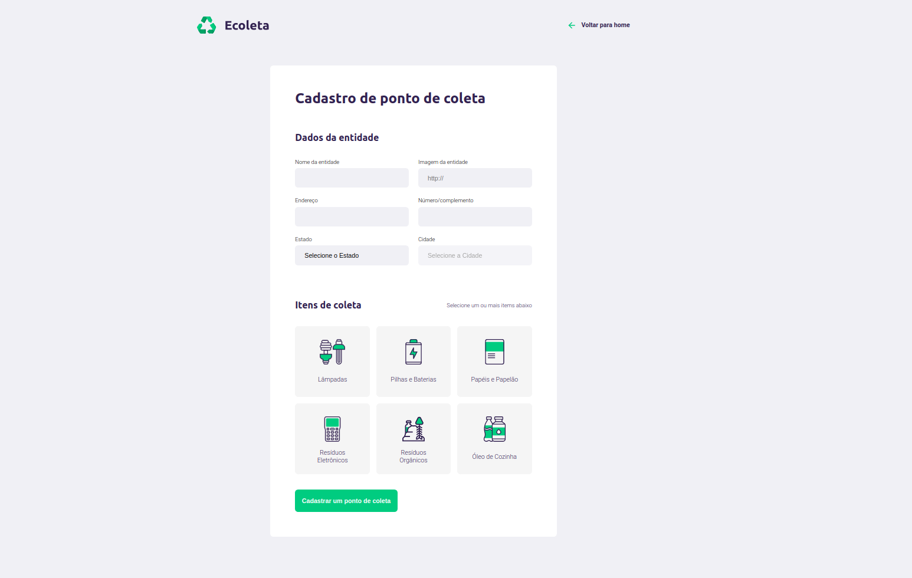
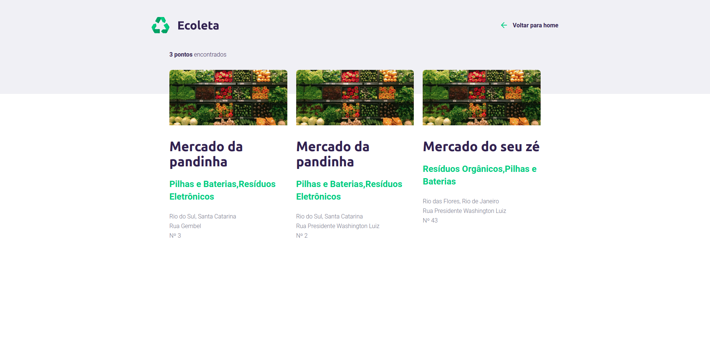

<h1 align="center">
  
</h1>

<h3 align="center">Ecoleta - Aplicação desenvolvida para facilitar o encontro de pontos de coletas.</h3>


<p align="center">



</p>


## 🚀 Tecnologias

Esse projeto foi desenvolvido com as seguintes tecnologias:

Backend:
- [Node.js](https://nodejs.org/en/)
- [Express](https://expressjs.com/pt-br/)
- [sqlite3](https://github.com/mapbox/node-sqlite3)


Frontend:
- Html
- CSS
- JavaScript

## 💾 Instalação

<h4>Execute os comandos abaixo</h4>

```bash
# Clone o repositório
$ https://github.com/rodrigosakamoto/ecoleta-starter.git

# Em seguida execute:

$ cd ecoleta-starter

$ yarn

$ yarn dev:server
```
---
By [Rodrigo Sakamoto](https://www.linkedin.com/in/rodrigo-sakamoto/)